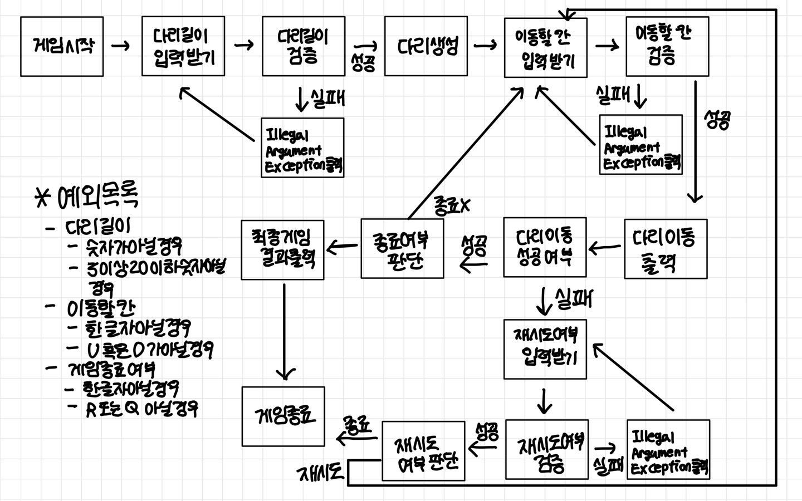

## :heavy_check_mark: 조건

### 규칙
- 다리의 길이를 숫자로 입력받고 생성
- 다리의 규칙
    - 위아래 두 칸으로 이루어져 있음
    - 다리는 왼쪽에서 오른쪽으로 건넘
    - 위아래 둘 중 하나의 칸만 건널 수 있음
    - 다리를 생성할 때 위 칸과 아래 칸 중 건널 수 있는 칸은 0과 1중 무작위 값
    - 건널 수 있는 칸은 0인 경우 아래 칸, 1인 경우 위 칸
    - 위칸을 건널 수 있는 경우 U, 아래 칸을 건널 수 있는 경우 D
- 다리 새성 후 플레이어가 이동할 칸 선택
- 이동 규칙
  - 이동 선택은 위칸을 원할 경우 U, 아래 칸을 원할 경우 D
  - 이동할 칸 건널 수 있다면 O, 건널 수 없다면 X
- 게임 종료
    - 다리를 끝까지 건너면 게임 종료
    - 다리를 건너다 실패하면 게임을 재시작하거나 종료
    - 재시작 시 처음에 만든 다리 재사용
    - 게임 결과의 총 시도한 횟수는 첫 시도 포함 게임 종료 시까지 시도한 횟수
- 사용자가 잘못된 값 입력할 경우 IllegalArgumentException를 발생

### 입출력
- 입력
  - 다리 길이 : 3 이상 20 이하의 숫자
  - 라운드마다 이동할 칸 : U(위 칸)와 D(아래 칸) 중 하나의 문자
  - 게임 재시작/종료 여부 :  R(재시작)과 Q(종료) 중 하나의 문자를 입력
- 출력
  - 게임 시작 문구
  - 게임 진행 문구
  - 게임 종료 문구 : 다리 이동, 게임 성공 여부, 총 시도한 횟수
      - 다리 이동 출력의 경우
          - 이동 가능 칸 선택한 경우 O, 이동 불가능 칸 선택한 경우 X, 선택하지 않은 칸 공백
          - 다리는 [  ] 표시, 칸 구분은 앞뒤 공백 포함 |
          - 현재까지 건넌 다리 모두 출력
  - 예외 상황 시 에러 문구 출력 : "[ERROR]" 로 시작해야 함
 
### 참고 사항
- indent(인덴트, 들여쓰기) depth를 3이 넘지 않도록 구현
- else 예약어 사용 금지
- 도메인 로직에 단위 테스트 구현
- 함수(또는 메서드)의 길이가 10라인을 넘어가지 않도록 구현
- 메서드의 파라미터 개수는 최대 3개까지만 허용
- 아래 있는 InputView, OutputView, BridgeGame, BridgeMaker, BridgeRandomNumberGenerator 클래스의 요구사항을 참고하여 구현

## :heavy_check_mark: 플로우 차트

## :heavy_check_mark: 구현
- BridgeMaker
  - 필드 : X
  - 다리 길이 검증
  - 다리 생성
- BridgeRandomNumberGenerator
  - 필드 : X
  - 다리 칸 생성
- Bridge
  - 필드: 다리
  - 다리 이동 가능 여부 비교
  - 다리 끝 도달 비교
- User
  - 필드 : 유저 입력
  - 이동할 칸 검증
  - 다리 이동 성공 여부
  - 다리 종료 여부
- BridgeGame
  - 이동
  - 재시도
- InputView
    - 다리 길이 입력 받기
    - 다리 길이 검증
    - 이동할 칸 입력 받기
    - 이동할 칸 검증
    - 종료 여부 입력 받기
    - 종료 여부 검증
- OutputView
  - 다리 출력
  - 결과 출력
  - 시작 문구 출력
  - 진행 문구 출력
  - 종료 문구 출력
  - 게임 성공 여부 출력
  - 총 시도한 횟수 출력
  - 에러 출력
- BridgeController
- 게임 시작
- 게임 진행
- 게임 종료
- InputException
  - 다리 길이 숫자 아닐 경우
  - 이동할 칸 한 글자 아닐 경우
  - 게임 종료 여부 한 글자 아닐 경우
  - 게임 종료 여부 R 또는 Q 아닐 경
- BridgeMakerException
  - 다리 길이 3 이상 20 이하 숫자 아닐 경우
- UserMoveException
   - 이동할 칸 U 혹은 D가 아닐 경우

